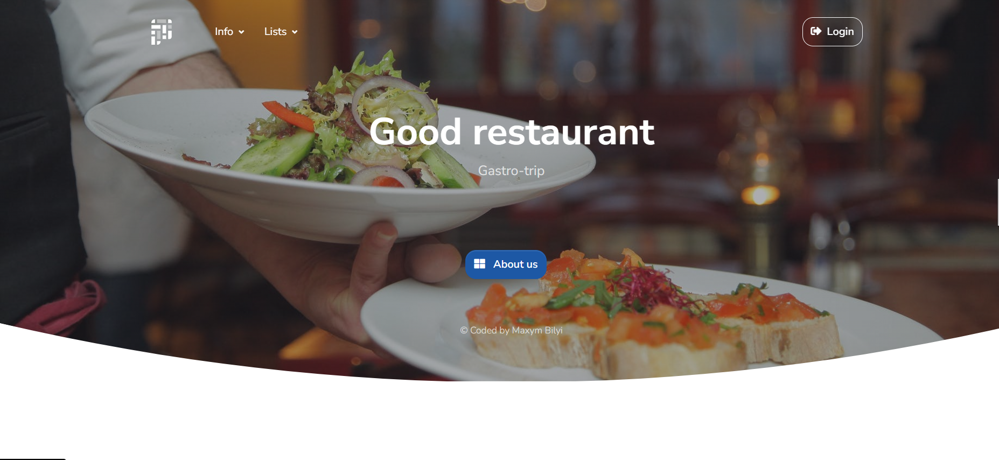
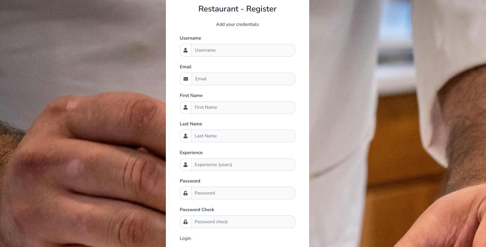

# Restaurant Kitchen Service Project

Web application for managing dishes and cooks in a restaurant kitchen


## Demo

Live demo: [Restaurant Kitchen Service](https://restaurant-kitchen-service-om6x.onrender.com)

Test credentials:
* Username: `admin`
* Password: `admin`


## Description

This Django-based web application helps restaurant staff manage kitchen operations, including:
- Dish management
- Cook assignments
- Ingredient tracking


## Features

* User authentication, authorization and registration
* CRUD operations for dishes, dish types, and ingredients
* Cook profile management
* Search functionality
* Google Maps integration for restaurant location
* Responsive design


## Installation

Python must be already installed

```shell
git clone ...
python -m venv venv
venv/Scripts/activate (for Windows)
venv/bin/activate (for MacOS and Linux)
pip install -r requerements.txt
python manage.py migrate
python manage.py runserver
```


### Environment Variables
Create `.env` file in the root directory based on `.env.sample`:

```dotenv
#DB
POSTGRES_DB=<db_name>
POSTGRES_DB_PORT=<db_port>
POSTGRES_USER=<db_user_name>
POSTGRES_PASSWORD=<db_password>
POSTGRES_HOST=<db_host>
```

Replace the placeholder values with your actual configuration:
- `<db_name>`: Your PostgreSQL database name
- `<db_port>`: Database port (default: 5432)
- `<db_user_name>`: Database username
- `<db_password>`: Database password
- `<db_host>`: Database host address


## Technologies Used

* Python
* Django
* PostgreSQL (SQLite locally)
* HTML/CSS
* Bootstrap
* SQLite
* Google Maps API


## Screenshots


Register own account

